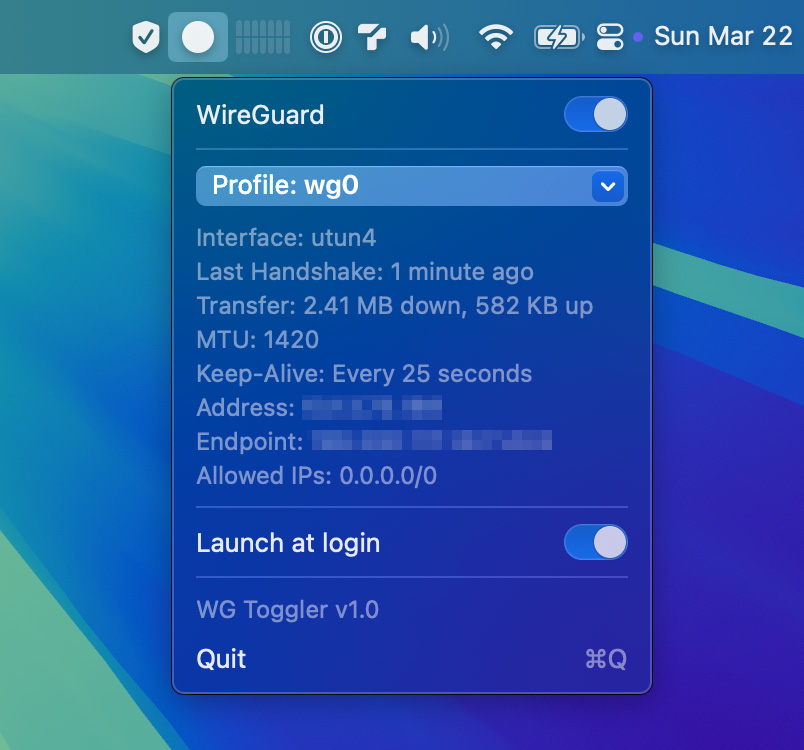

<p align="center">
    
</p>

<h1 align="center">WG Toggle</h1>

<p align="center">
  
</p>

WG Toggle is yet another tiny unofficial menubar utility to turn on or off your `wireguard-tools` connection and conveniently switch profiles.

## Disclaimer + TOS

Use this at your own risk. It works for me, but I can’t guarantee it will work as expected on your setup. By using WG Toggle, I assume no responsibility if it messes up your system.

## Getting Started

### Download the release

1. Download [wg-toggle.app.zip here](https://github.com/ilovedoumiao/wg-toggle/releases)
2. Unzip file and move the app to your Applications folder
3. Open WG Toggle and find it on your menu bar with the circle icon.

#### Notes

You'd need to already have `wireguard-tools` installed.

`$ brew install wireguard-tools`

Release is not notarized so you may need to right click and choose Open from the context menu once.

Use your favorite VPN service to generate config files for WireGuard and place them in `/opt/homebrew/etc/wireguard`. WG Toggle will automatically present them in the Profiles selector.

If you use WireGuard with NextDNS, add `DNS = 127.0.0.1` under `[Interface]` in your config files.

or

### Build from source

```bash
git clone https://github.com/ilovedoumiao/wg-toggle.git
```

#### Notes

I've set the project to build for only `arm64` so change accordingly if you need a Universal build.

## Support
If you find this useful, [buying me a coffee](https://buymeacoffee.com/coffeeguzzler) ☕️ to fuel my day will be very much appreciated.
